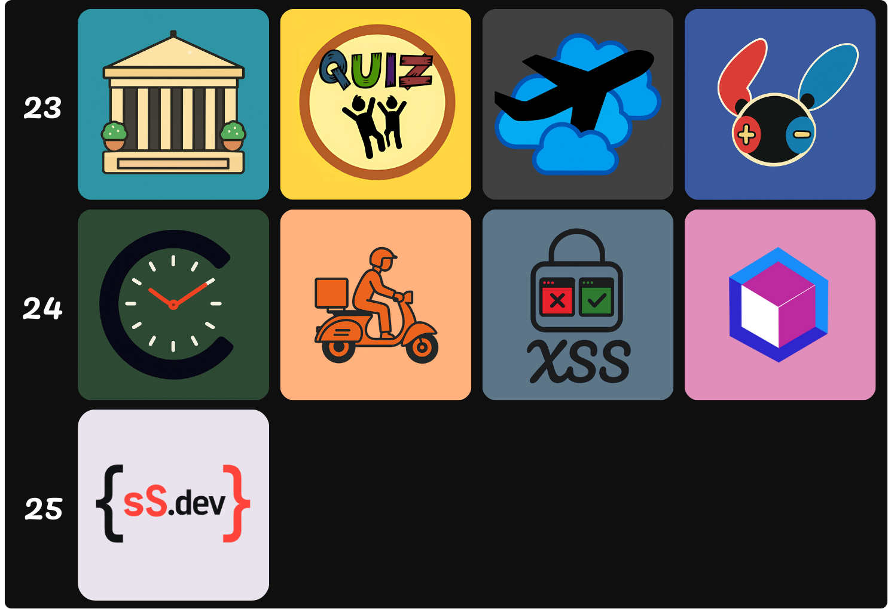

# Hello, I'm Shiva Sathyadev, aka Indy! 👋

## 👨🏾 About Me

- 👨🏾 Film Nerd, Tech Enthusiast, People Person, He/Him
- 🌱 I’ve graduated in Computer Science specialising in CyberSecurity!
- 🔭 I’m currently working as an Assistant Tutor and part of the Peer Learning Program at the University of Wollongong.
- 💼 I enjoy pursuing projects in the realms of -> my_interests = ['Data Analysis', 'Software Engineering', 'IT', 'Cybersecurity'] !
- 📫 How to reach me:

     
     
     

- ⚡ Fun fact: I enjoy using code to solve problems I encounter in my day-to-day life. This means I spend weeks learning new concepts, ideas and fundamentals. Instead of spending 2 hours manually accomplishing goals, I use code to accomplish them by spending weeks iterating on an application instead.

## Completed Projects

- **Great Museum Guide** 📲  
  Beginners’ app showcasing museum exhibits and user navigation. 🏛️

- **Quiz For Kids** 📲   
  Advanced quiz app designed to engage children with educational content. 🧠

- **Fly Dream Air** 📲  
  Ticket-booking prototype applying project-management principles. ✈️

- **Collectomon** ([Repo](https://github.com/IndyShivy/CollectomonV2_Release))) 📲   
  Search, view, and store Pokémon-card details with a focus on illustrators. 🗂️

- **Countdown** ([Repo](https://github.com/IndyShivy/Countdown)) 📲   
  Create events and track time remaining in days, weeks, fortnights, or months. ⏳

- **FoodHub** 💻   
  Full-stack dashboard for restaurant–customer interactions, demonstrating UI design and business logic. 🍽️

- **XSS Demo** 💻   
  Interactive demo highlighting insecure vs. secure cross-site scripting implementations. 🔐

- **ADAPT** ([Deployed](https://adapt-mvp.vercel.app/)) 💻   
  Data dashboard visualizing Australian aging-population trends using census datasets. 📊

     

 

## In-Progress Projects
- **sS.dev** 💻 
  ???. 💼👨🏾

## ⚙ Skills

## 🛠️ Tools:

## My Work

## Let's Connect! (Coming Soon)

<!-- Customize your badges on https://shields.io/ and icons on https://simpleicons.org/ -->

